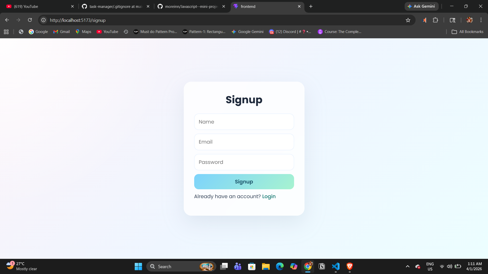
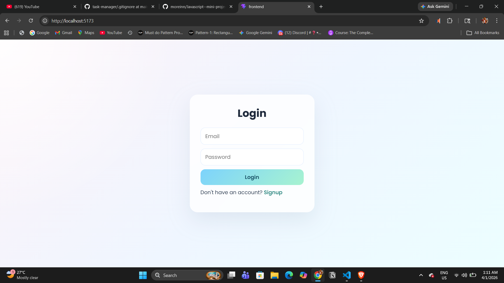
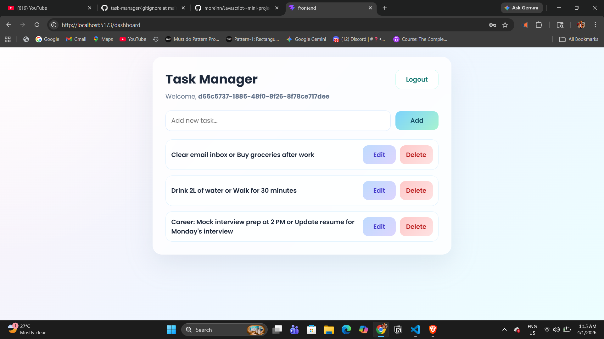
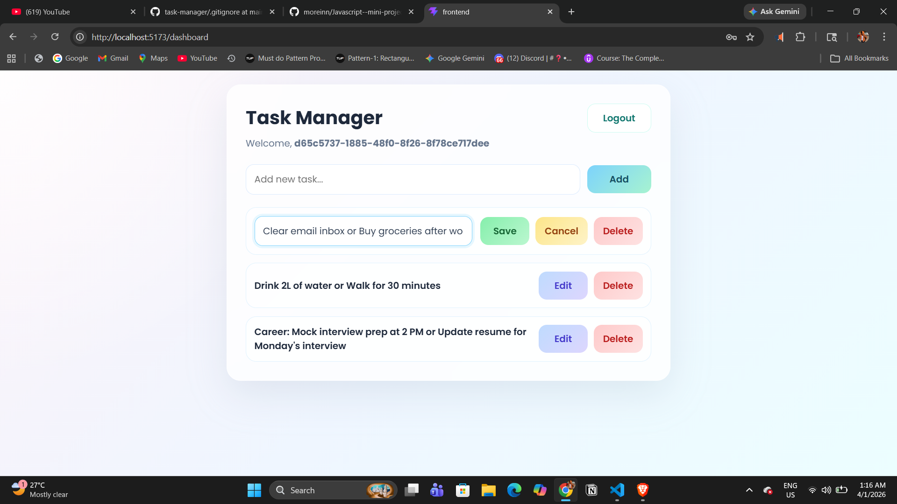

📝 Task Manager App

A full-stack task management application where users can securely sign up, log in, and manage their personal tasks with create, edit, complete, and delete functionality.

🚀 Features
🔐 User Authentication (Signup & Login)
🔒 Protected Routes
✅ Create, Edit, Delete Tasks
✔️ Mark tasks as completed
👤 User-specific task management
⚡ Fast and responsive UI

🛠️ Tech Stack
🎨 Frontend
React (Vite)
React Router DOM (Routing & Protected Routes)
Zustand (State Management)
Axios (API Requests)
CSS 
⚙️ Backend
Node.js
Express.js (REST API)
JWT (Authentication)
Bcrypt.js (Password Hashing)
Cookie Parser (Session handling)
CORS (Cross-origin requests)
Dotenv (Environment variables)
🗄️ Database
SQLite (Lightweight database)

📁 Project Structure
task-manager/
│
├── backend/
│   ├── controllers/
│   ├── routes/
│   ├── middleware/
│   └── server.js
│
├── frontend/
│   ├── src/
│   └── public/
│
└── .gitignore

### 🔐 Signup Page

---

### 🔑 Login Page

---

### 📋 Dashboard (Task List)

---

### ✏️ Edit Task

🙌 Author

Moinuddin Shaikh

⭐ If you like this project

Give it a star on GitHub ⭐

  

